# Heart Disease Prediction Model

## Overview

This project focuses on analyzing and predicting cardiovascular disease risk based on patient medical data. Necessary information may include medical history, test results, lifestyle information, and health indicators. In this way, the system can build a model to predict the occurrence of cardiovascular disease and estimate the individual risk of each patient.

## Dataset

To ensure we select the most appropriate dataset for building our heart disease prediction model, we analyzed and compared three different datasets. Below are the details of each dataset and the rationale behind our final choice.

### Dataset 1: Indicators of Heart Disease (2020)

- **Source**: [Centers for Disease Control and Prevention(CDC)](https://www.kaggle.com/datasets/kamilpytlak/personal-key-indicators-of-heart-disease/data)
- **Size**: 320,000 instances, 18 attributes
- **Attributes**: 
    1. **HeartDisease**: Participant ever reported having cardiovascular disease or myocardial infarction (CHD) or myocardial infarction (MI).
    2. **BMI**: Body Mass Index (BMI).
    3. **Smoking**: Have you smoked at least 100 cigarettes in your entire life? [Note: 5 packs = 100 cigarettes].
    4. **AlcoholDrinking**: Heavy drinker (adult men drinking more than 14 drinks per week and adult women drinking more than 7 drinks per week).
    5. **Stroke**: Have you ever had a stroke?
    6. **PhysicalHealth**: For how many days during the past 30 days was your physical health not good, including illness and injury?
    7. **MentalHealth**: For how many days during the past 30 days was your mental health not good?
    8. **DiffWalking**: Do you have serious difficulty walking or climbing stairs?
    9. **Sex**: Are you male or female?
    10. **AgeCategory**: Age group including fourteen levels.
    11. **Race**: What is your race?
    12. **Diabetic**: Have you been diagnosed with diabetes?
    13. **PhysicalActivity**: Adults reported engaging in exercise or physical activity in the past 30 days other than their regular job.
    14. **GenHealth**: Would you say that in general your health is?
    15. **SleepTime**: On average, how many hours of sleep do you get in a 24-hour period?
    16. **Asthma**: Have you ever been told you have asthma?
    17. **KidneyDisease**: Have you ever been told you have kidney disease?
    18. **SkinCancer**: Have you ever been told you have skin cancer?


- **Pros**: No null values, Large sample size
- **Cons**: Imbalance dataset.

### Dataset 2:  UCI Heart Disease Data

- **Source**: [Cleveland Clinic Foundation](https://www.kaggle.com/datasets/redwankarimsony/heart-disease-data)
- **Size**: 920 instances, 16 attributes
- **Attributes**: 
    1. **id**: The unique identifier for each patient.
    2. **age**: The age of the patient.
    3. **sex**: The gender of the patient.
    4. **dataset**: The source of the data.
    5. **cp (chest pain type)**: The type of chest pain experienced, including 4 types: typical angina, atypical angina, non-anginal, and asymptomatic.
    6. **trestbps (resting blood pressure)**: The resting blood pressure measured in mm Hg.
    7. **chol**: The serum cholesterol level measured in mg/dl.
    8. **fbs**: Whether the patient's fasting blood sugar is greater than 120 mg/dl or not (TRUE if yes, FALSE if no).
    9. **restecg**: The resting electrocardiographic results, including 3 options: normal, ST-T wave abnormality, and left ventricular hypertrophy.
    10. **thalach**: The maximum heart rate achieved by the patient.
    11. **exang**: Whether the patient experiences exercise-induced angina or not (TRUE if yes, FALSE if no).
    12. **oldpeak**: The ST depression induced by exercise relative to rest.
    13. **slope**: The slope of the peak exercise ST segment.
    14. **ca**: The number of major vessels colored by fluoroscopy.
    15. **thal**: The thalassemia status of the patient (a genetic blood disorder).
    16. **num**: Indicates the presence of heart disease in the patient. 
         - 0: No heart disease.
         - 1: Mild or asymptomatic heart disease.
         - 2: Moderate heart disease.
         - 3: Severe heart disease.
         - 4: Extremely severe heart disease.
- **Pros**: Rich feature set, more detailed
- **Cons**: Requires extensive preprocessing, Null Values, Limited rows of data.

### Dataset 3: Heart Disease Health Indicators Dataset

- **Source**: [Centers for Disease Control and Prevention(CDC) ](https://www.kaggle.com/datasets/alexteboul/heart-disease-health-indicators-dataset)
- **Size**: 254,000  instances, 22 attributes
- **Attribute**
    1. **HeartDiseaseorAttack**: Have you ever had heart disease or a heart attack?
    2. **HighBP**: Do you have high blood pressure?
    3. **HighChol**: Do you have high cholesterol?
    4. **CholCheck**: Have you had your cholesterol checked recently?
    5. **BMI**: What is your BMI (Body Mass Index)?
    6. **Smoker**: Have you ever smoked?
    7. **Stroke**: Have you ever had a stroke?
    8. **Diabetes**: Do you have diabetes?
    9. **PhysActivity**: Do you engage in physical activity?
    10. **Fruits**: Do you consume fruits daily?
    11. **Veggies**: Do you consume vegetables daily?
    12. **HvyAlcoholConsump**: Do you consume more than 14 alcoholic drinks per week?
    13. **AnyHealthcare**: Do you have healthcare insurance?
    14. **NoDocbcCost**: Have you had a doctor's checkup recently?
    15. **GenHlth**: How would you rate your overall health? (from 1 to 5)
    16. **MentHlth**: How many days in the last 30 days has your mental health not been good?
    17. **PhysHlth**: How many days in the last 30 days have you been injured, including illness and physical injury?
    18. **DiffWalk**: Do you have difficulty walking?
    19. **Sex**: What is your gender? (1 for male / 0 for female)
    20. **Age**: Which age group do you belong to? From 1 (18 to 24 years old) to 13 (80 years old and above), each group has a 5-year range.
    21. **Education**: Indicates the highest level of education completed, from 0 (never attended school or only attended kindergarten) to 6 (completed 4 or more years of college).
    22. **Income**: What is your monthly income?

- **Pros**: Large sample size, No Null values
- **Cons**: Different data distribution, potential overfitting, skewed data, imbalance dataset.

### Comparison

We evaluated the datasets based on their size, feature richness, ease of preprocessing, and relevance to our project goals.

- **Indicators of Heart Disease (2020)**
#### Number of People with Heart Disease

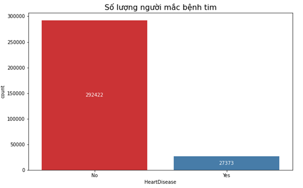    
- Considering the number of people with and without heart disease for prediction model purposes, we can observe a significantly higher number of people without heart disease compared to those with heart disease (approximately 10 times more). Therefore, the dataset may cause imbalance issues for the prediction model.

#### Health Status of Patients
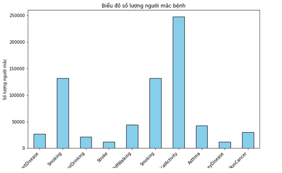 
- Observing the graph, we can see a highly skewed distribution of the columns, which may likely lead to imbalance issues for the prediction model.

#### Physical and Mental Health Status of Patients
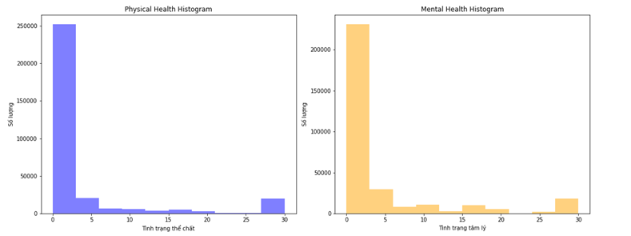 
- The physical and mental health status is severely skewed due to a large number of 0 values, which could cause severe imbalance issues for the prediction model.

#### Number of Patients by Age and Heart Disease Status
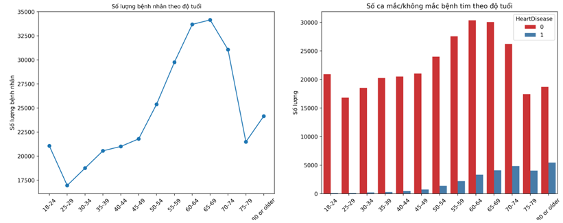 
- The age distribution of heart disease appears to be fairly even, indicating a proportional relationship between age and heart disease. However, at younger ages, the proportion of patients with heart disease is significantly lower.

#### Heart Disease Rate by Sleep Time
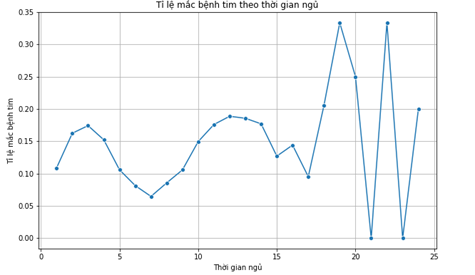
- Observing the chart, we can see that the information about sleep time is highly skewed, making it difficult to interpret. The proportion changes continuously after the 15-hour mark, and the sleep time distribution seems unrealistic.

#### Distribution of BMI for Patients with/without Heart Disease
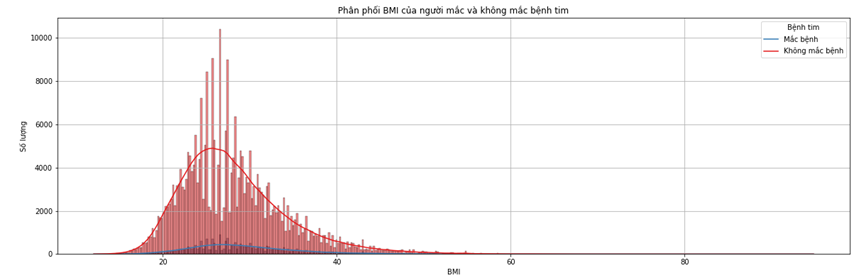
- Similar to sleep time, the information about BMI is also skewed and noisy, leading to an uneven distribution that may cause imbalance issues.

#### Heart Disease Rate by Health Status
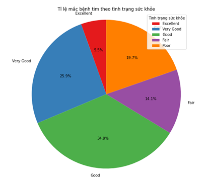
- The chart shows a relatively even distribution of heart disease rates by health status.

#### Diabetes Status Ratio
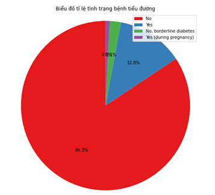
- The chart displaying the ratio of diabetes status distribution is uneven, which may lead to imbalance issues in the prediction model.

#### Dataset Quality Assessment
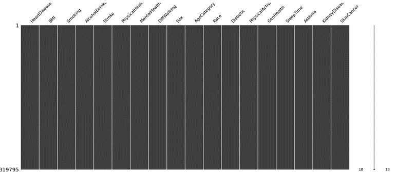


- **UCI Heart Disease Data**
#### Number of People with Heart Disease
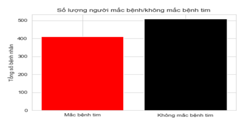
- Upon examining the number of people with and without heart disease to serve the predictive model, we can observe an equal proportion of people with and without heart disease. This will not pose a challenge for analysis.

#### Distribution of Cholesterol Levels among Patients with/without Heart Disease
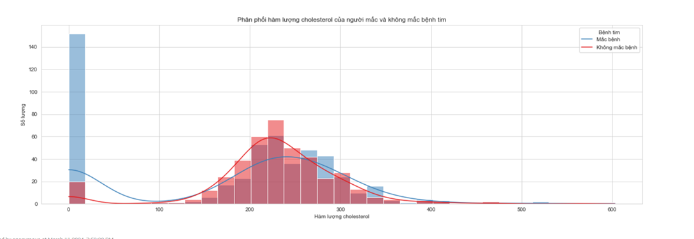
- Looking at the chart above, we can see that as cholesterol levels increase, the likelihood of having heart disease also increases. Overall, the data is fairly suitable for analysis, but there is an issue with many cholesterol values being 0, which is medically unreasonable. This also poses some difficulty in analysis. The solution here would be to replace 0 values with NULL.

#### Number of Patients with/without Heart Disease by Age
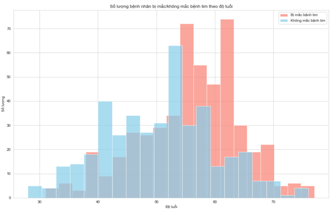
- Among patients with heart disease, those aged between 55-70 are the most numerous. Meanwhile, patients aged 30-40 have the fewest cases of heart disease. No one below the age of 30 has heart disease. From the chart, we can see that as age increases, the risk of heart disease also increases.

#### Impact of Resting Blood Pressure on Heart Disease
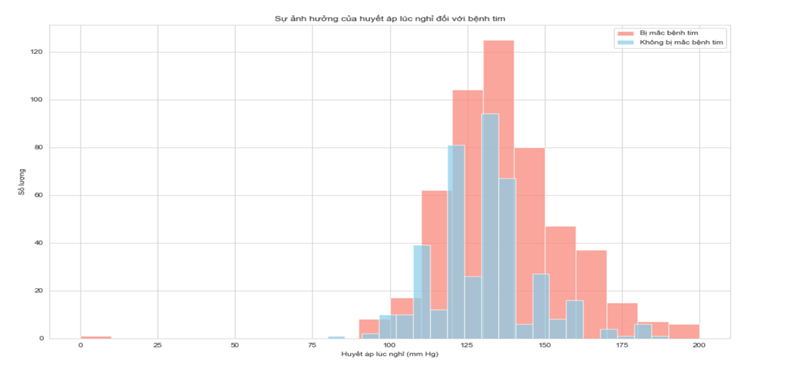
- In the chart above, we see that as resting blood pressure increases, the proportion of people with heart disease also increases. Patients with blood pressure approaching 200 are all diagnosed with heart disease, while those with lower blood pressure have a lower incidence of heart disease. Looking at the conclusion below, we can see that the average resting blood pressure of patients with heart disease is higher than those without.

#### Rate of Different Chest Pain Types among Patients
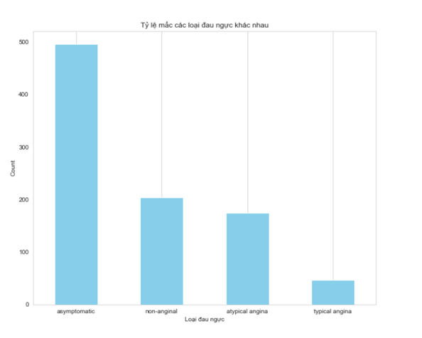
- Looking at the chart above, we can see that the majority of patients do not exhibit symptoms of chest pain (asymptomatic). The number of patients with typical angina chest pain is the lowest.

#### Influence of ST Depression on Heart Disease
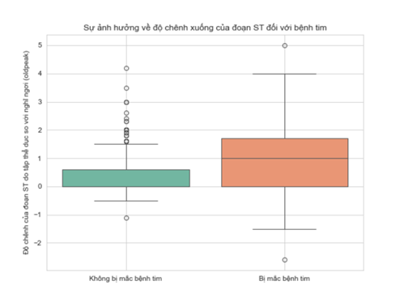
- Looking at the chart above, we can see that patients with heart disease have higher ST segment depression compared to those without.

#### Dataset Quality Assessment
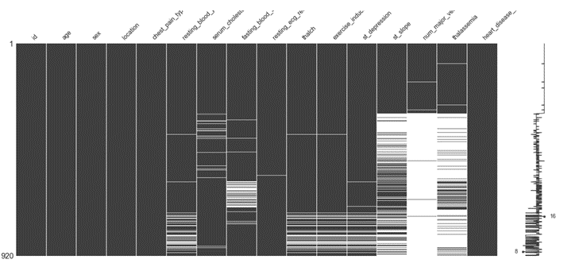
- The dataset has significant shortcomings, especially in the min_major_vessels and thalassemia columns, with corresponding missing value rates of 66.41% and 52.83%. Additionally, other noteworthy missing attributes include st_slope (33.59%), fbs (9.78%), and oldpeak (6.74%), while many other columns have no missing values.

- **Heart Disease Health Indicators Dataset**
#### Number of People with Heart Disease
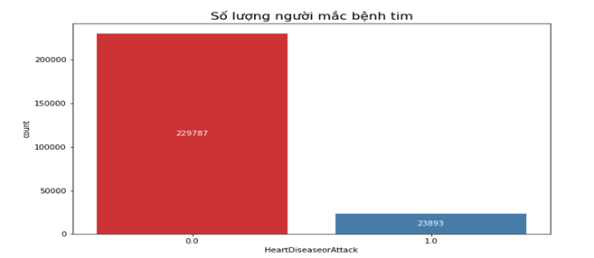
- Observing the chart, we can see a significant disparity in the ratio of people with and without heart disease, which could lead to imbalance issues when used in predictive models.

#### Health Status of Patients

- The distribution of health status columns appears highly skewed, potentially leading to imbalance issues for predictive models.

#### Number of Patients by Age and Heart Disease Status
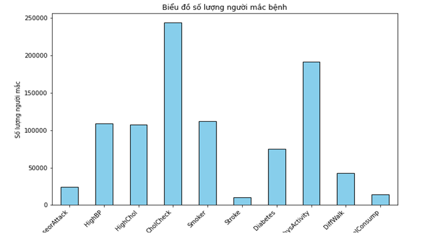
- The distribution by age and heart disease appears fairly even, with the chart showing a proportional increase in the number of heart disease cases with age. However, at younger ages, the proportion of patients with heart disease is very low.

#### Distribution of BMI among Patients with/without Heart Disease
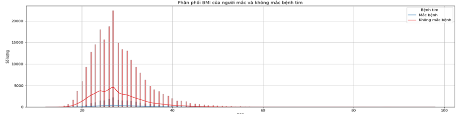
- Observation suggests that the distribution of BMI is somewhat okay, but there are still some outliers that need to be addressed to reduce imbalance issues.

#### Heart Disease Rate by Health Status
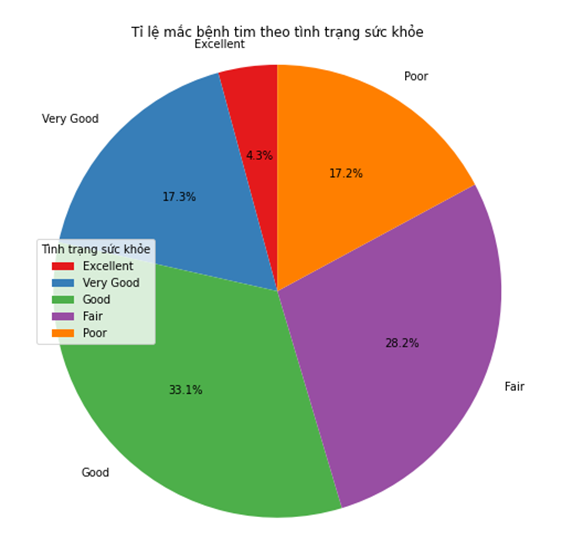
- The chart shows a relatively even distribution of heart disease rates by health status.

#### Heart Disease Rate by Diet
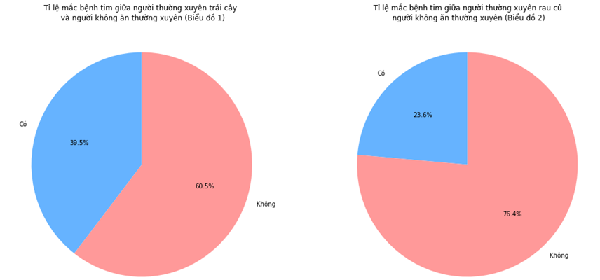
- Observing the chart, we can see that patients who do not consume fruits and vegetables mostly contribute to the heart disease cases. The data may need to be reorganized for better balance.

#### Heart Disease Rate by Alcohol Consumption
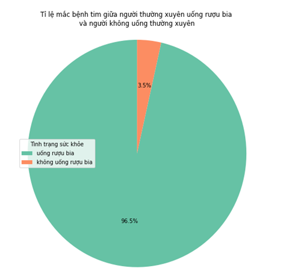
- The chart indicates that alcohol consumption may increase the risk of heart disease, as a large proportion of alcohol consumers are diagnosed with heart disease (96.5%).

#### Dataset Quality Assessment
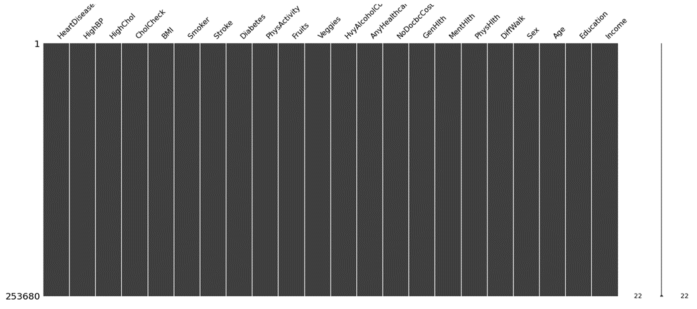


### Conclusion

We selected the **Indicators of Heart Disease (2020)** dataset for our project because it strikes a balance between simplicity and relevance, allowing us to quickly develop and validate our model. 

## Data Analysis and Evaluate Model 

You can find details about model in our notebook. Following **"Report_Model_Prediction_Jupyter"**.

## Model

The project uses various machine learning algorithms to predict heart disease, including:

- Logistic Regression
- Gradient Boosting
- Neural Networks

## Installation

To run this project, you need to have Python installed along with the following libraries:

- pandas
- numpy
- scikit-learn
- matplotlib
- seaborn
- prettytable

You can install the required libraries using the following command:

```bash
pip install pandas numpy scikit-learn matplotlib seaborn prettytable
```

## Usage

Clone the repository:
```bash
git clone https://github.com/Phuccc6903/Heart-Disease-Prediction.git
```
Run the Jupyter Notebook:
```bash
jupyter Report_Model_Prediction_Jupyter.ipynb
```
Make predictions:

You can use the trained model to make predictions on new data by providing the relevant medical attributes.

## Results
The performance of the models is evaluated and compared based on their accuracy and other relevant metrics. The model with the highest performance is selected for making predictions.